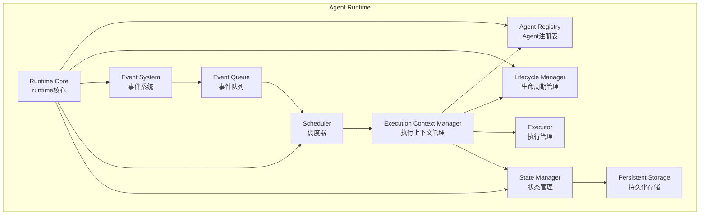
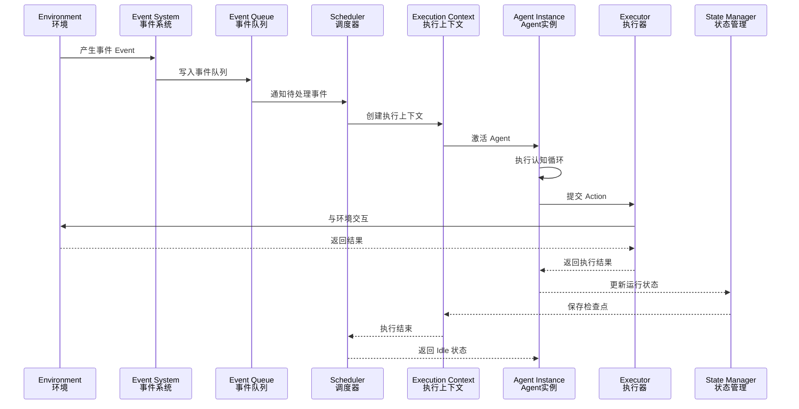

# runtime模块架构
相较于先前任务绑定式的agent运行，我们将agent定义为持续运行的软件实体，将任务作为agent运行生命中的一个部分而非整个生命周期。同时agent相当于OS中的线程受到控制。
# runtime职责
### 管理agent生命与注册
### 接受与调度任务
### 持久化状态
# 总体架构

Runtime 由以下核心模块组成：

- Runtime Core
- Agent Registry
- Lifecycle Manager
- Event System
- Scheduler
- Execution Context
- Executor
- State Manager

整体架构为：

# 运行时序
一次 Agent 执行过程由事件触发。

流程：

1. 外部事件进入 Runtime
2. Event System 接收并排队
3. Scheduler 调度目标 Agent
4. 创建 Execution Context
5. Agent 执行任务
6. Executor 执行动作
7. State Manager 保存状态
8. Agent 返回等待状态

