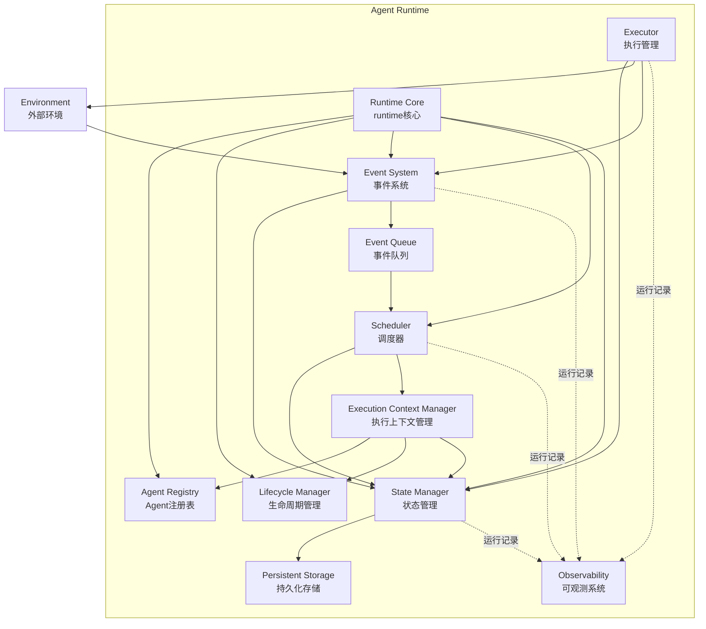
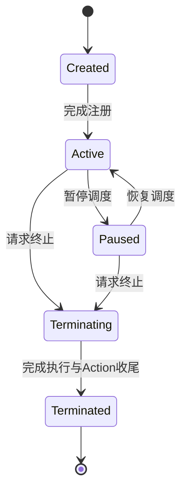
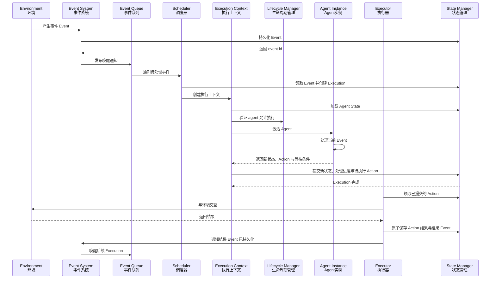

# runtime模块架构
相较于先前任务绑定式的agent运行，我们将agent定义为持续运行的软件实体，将任务作为agent运行生命中的一个部分而非整个生命周期。同时agent相当于受到runtime调度的逻辑线程。

agent拥有长期身份与持久状态。一次agent运行称为Execution，每次Execution处理一个Event。Execution提交后保存agent状态并释放执行资源，后续事件触发新的Execution。

runtime首先以单进程方式建立完整运行语义，各模块通过稳定接口协作。随着项目扩大，调度、执行、存储等模块可以逐步拆分为独立进程或服务，agent模型与运行协议在各类部署方式下保持一致。

# runtime职责
### 管理agent生命与注册
### 接受事件与调度执行
### 管理执行上下文与计算资源
### 持久化状态与恢复运行
### 控制agent与外部环境交互
### 记录并提供可验证的运行过程

# 目标与runtime边界
目标的定义、分解、进度和完成判据由上层agent应用管理。runtime负责事件处理、状态持久化、Action执行和资源约束，并提供关联执行过程所需的标识与记录。

Execution成功表示本轮事件处理完成，目标是否完成由上层根据完成判据判断。

# 设计目标
### agent与Execution分离
agent拥有长期身份与状态，Execution代表agent处理一次事件的运行过程。一次Execution结束后，agent继续保留自身身份与历史状态。

### 模块边界稳定
模块之间通过接口协作。进程内实现、数据库实现和远程实现遵守相同契约，使runtime能够逐步扩展部署规模。

### 状态变化可恢复
事件、Execution和agent状态的关键变化进入持久化记录。runtime异常退出后可以识别执行进度，并继续完成恢复流程。

### 外部动作可控制
agent通过Execution Context向Executor提交Action。runtime统一处理权限、超时、重试、幂等和运行记录。

### 运行过程可观测
每个Event、Execution、Action和状态变化都具有稳定标识。日志、指标和追踪信息通过这些标识建立关联。

### 运行语义持续一致
项目从单进程逐步演进到多节点部署，领域模型、状态转换和可靠性语义保持一致。

# 核心概念
### Agent Definition
描述一类agent的代码入口、版本、配置结构和需要的能力。

### Agent Instance
一个持续存在的agent实例，拥有唯一标识、生命周期状态、当前版本和持久状态。

### Event
触发agent运行的输入。任务、定时器、外部消息、Action结果和人工输入都属于Event。

### Execution
agent处理一次Event的运行过程，记录执行状态、结果和错误信息。

### Execution Context
一次Execution能够访问的运行环境，包含当前Event、agent状态、取消信号、资源限制以及允许使用的能力。

### Action
agent向外部环境发出的操作请求，与本轮Execution结果一起持久化，提交后由Executor负责执行。Action结果通过Event交付。

### Wait Condition
agent继续运行所需的事件条件，与恢复所需的状态一起持久化，等待期间不占用Execution。

### Checkpoint
agent状态与事件处理进度的一致性快照，用于Execution完成后的持久化和异常恢复。

# 总体架构

Runtime 由以下核心模块组成：

- Runtime Core
- Agent Registry
- Lifecycle Manager
- Event System
- Scheduler
- Execution Context Manager
- Executor
- State Manager
- Observability

整体架构为：

# 模块职责
### Runtime Core
负责runtime的启动、停止和模块组装。Runtime Core承担协调职责，具体业务状态由State Manager管理，调度与执行分别由对应模块完成。

### Agent Registry
负责Agent Definition与Agent Instance的注册、版本查询和实例定位。agent运行由Execution Context Manager负责激活。

### Lifecycle Manager
负责验证agent生命周期状态迁移。所有生命周期变化通过Lifecycle Manager验证，由State Manager在对应事务中保存，形成统一状态记录。

### Event System
负责接收、验证、持久化和发布Event。Event进入调度前获得稳定的event id。

### Scheduler
负责接收Event Queue的唤醒通知，从持久化记录中领取Event，并根据优先级、资源限制、公平性和agent并发策略创建Execution。

### Execution Context Manager
负责加载agent状态、创建Execution Context并激活agent。Context限定一次执行能够读取的状态和能够调用的能力，收集新状态、Action请求和等待条件，通过State Manager统一提交。

### Executor
负责执行已提交的Action，并统一处理权限、超时、取消、重试和幂等。执行结果通过Event System交付。各类Action可以拥有对应的Executor实现。

### State Manager
负责保存Agent State、Execution、Checkpoint和处理进度，并提供一致性事务与异常恢复能力。

### Persistent Storage
提供持久化接口。初期实现采用SQLite，后续可以扩展数据库、对象存储和远程存储实现。

### Observability
负责日志、指标、追踪和审计事件。可观测数据使用独立通道写入，核心运行流程保持稳定执行。

# agent生命周期

agent生命周期由Lifecycle Manager统一管理。生命周期描述实例是否允许运行，Execution状态描述单次事件的执行进度，等待条件描述后续事件如何继续目标。

状态含义：

- Created：agent实例已经创建，正在完成注册
- Active：agent允许处理Event，当前可以处于执行、空闲或等待状态
- Paused：agent停止领取新Event与新Action，已领取的操作按取消策略处理
- Terminating：agent停止新工作，正在处理活跃Execution、Action与等待条件
- Terminated：agent实例生命周期已经结束

需要等待模型、工具或人工结果时，agent将恢复所需的状态与等待条件一并提交，结束本轮Execution。后续结果Event触发新的Execution。

# 运行时序
一次Agent Execution由事件触发。

流程：

1. 外部事件进入Runtime
2. Event System验证并持久化Event
3. Event System向Event Queue发布唤醒通知
4. Scheduler领取Event并创建Execution
5. Execution Context Manager加载agent状态
6. 确认agent允许执行并激活agent
7. agent处理当前Event，返回新状态、Action请求与等待条件
8. State Manager提交本轮结果，Execution结束
9. Executor领取已提交的Action并与外部环境交互
10. Action结果与结果Event原子保存，后续Event触发新的Execution

# 可靠性语义
### Event投递
runtime采用at-least-once语义。Event在异常恢复时可能再次进入处理流程，因此Event与Action使用稳定标识完成重复识别。

持久化Event是调度依据，内存队列只负责唤醒，队列通知丢失不影响事件恢复。

### Action幂等
Action先持久化再执行，恢复时使用已保存的请求与结果。Executor通过稳定标识与幂等键识别重复请求，外部副作用的幂等保证由对应能力提供，无法确认的执行结果按能力声明的恢复策略处理。

### 状态提交
State Manager统一提交Agent State、Checkpoint、Execution结果、Event处理进度及本轮产生的生命周期变化、等待条件与Action，保证本轮状态变化的一致性。Action结果与对应结果Event原子保存。

### Execution租约
Scheduler通过租约管理Execution所有权。租约失效后可以重新调度，State Manager拒绝过期执行者提交状态。

### 重试
重试策略由错误类型、重试次数和退避规则共同决定。错误分为业务错误、临时错误和runtime错误，并采用对应恢复策略。

### 取消
取消通过Execution Context传播，由agent与Executor协作处理。取消执行不代表已经发生的外部副作用被撤销，已发出的Action按对应能力契约处理。

# 并发与调度
第一阶段同一个agent实例串行处理Event，多个agent可以分别运行，已提交的Action由Executor独立执行。

同一agent的并行Execution留待后续阶段，在明确状态合并、冲突处理与外部副作用语义后引入。

Scheduler支持：

- Event优先级
- agent级并发限制
- Executor级资源限制
- 公平调度
- 延迟与定时执行
- 暂停、恢复与取消
- Execution租约与超时回收

调度策略与执行机制保持分离。调度算法和部署方式可以独立演进，Agent与Execution模型保持稳定。

# 状态与存储
State Manager对上提供领域级存储接口，业务模块通过领域模型访问状态。

需要持久化的主要数据：

- Agent Definition与版本
- Agent Instance与生命周期状态
- Event与投递状态
- Execution与尝试记录
- Agent State与Checkpoint
- Action与执行结果
- 定时器与等待条件

存储实现支持schema迁移和数据版本迁移。Agent Definition升级时识别旧状态，并通过迁移函数或兼容执行器完成升级。

# Executor与能力控制
Executor是agent访问外部环境的统一出口。Action按能力类型注册，例如文件、网络、进程、模型和人工交互。

每个能力声明：

- 输入与输出结构
- 权限范围
- 超时与资源限制
- 取消方式
- 幂等策略
- 重试策略
- 运行记录规则

随着项目扩大，Executor可以从进程内实现拆分为隔离进程、容器或远程执行节点，对agent暴露的Action契约保持一致。

# 扩展与版本管理
Runtime内部模块通过接口组合。扩展实现通过显式注册进入runtime，全局状态保持明确和可追踪。

以下内容独立维护版本：

- Agent Definition
- Event结构
- Action结构
- Agent State结构
- Storage schema
- Runtime协议

版本升级优先保持向后兼容。协议发生结构变化时提供迁移路径，并在加载历史数据前完成验证。

# 可观测与审计
Event、Execution和Action共享关联标识，使一次agent运行能够跨模块追踪。

runtime记录以下信息：

- Event接收、领取与完成时间
- Execution状态变化与耗时
- Action类型、状态与耗时
- agent状态版本与Checkpoint位置
- 调度等待时间与资源使用情况
- 重试、取消与恢复过程

日志服务于问题定位，指标服务于运行状态判断，追踪服务于跨模块调用分析，审计记录服务于关键操作验证。

# 部署演进
### 第一阶段
采用单进程模块化runtime，使用SQLite作为持久化调度依据，内存队列负责唤醒，验证完整运行闭环。每个agent串行执行，所有Action通过结果Event交付结果。

### 第二阶段
将Executor拆分为独立worker，使高风险或高消耗Action获得独立资源与运行隔离。

### 第三阶段
将Scheduler、Event Queue和State Manager拆分为独立服务，并增加多个runtime节点。

### 长期阶段
围绕统一Runtime协议扩展多租户、资源配额、分布式调度、跨节点恢复和管理控制面。

每个阶段聚焦模块部署位置与容量扩展，Event、Execution、Action和Checkpoint的基本语义保持稳定。
